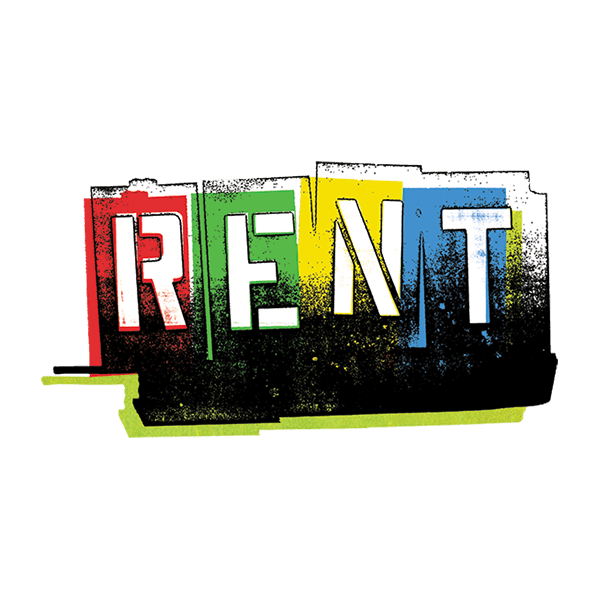

<a name="home"></a>
<div align="center">
  <a href="https://github.com/leenfhd/rentItOut-">
    
  </a>

  <h1 align="center">RentItOut  🏠</h3>
  
  <p align="center">
<strong>Peer-to-Peer	Rental	Platform	for	Everyday	Items - Easy Renting for many needs!</strong>
  </p>
  <br>
  
## 🏷️ Badges


This project is actively maintained and open for contributions. Check out the documentation for more details!
    <div align="center">
          <a href="https://github.com/leenfhd/rentItOut-/wiki"><strong>Explore The Documentation »</strong></a>
  <p align="center">
    <br/>
    <br/>
    <a href="demo-link"><strong>▶️ Demo</strong></a>
    &nbsp;&nbsp;&nbsp;&nbsp;
    <a href="https://github.com/leenfhd/rentItOut-/issues/new"><strong>🐞 Report Bug</strong></a>
    &nbsp;&nbsp;&nbsp;&nbsp;
  </p>
</div>
  </p>
  </div>
  
---

<details>
  <summary><h2>📋 Table of Contents<h2\></summary>
  <ol>
    <li><a href="#introduction">Introduction</a></li>
    <li><a href="#corefeatures">Core Features</a></li>
    <li><a href="#extrafeatures">Extra Features</a></li>
    <li><a href="#roles">Roles</a></li>
    <li><a href="#tools">Tools</a></li>
    <li><a href="#gs">Getting Started</a></li>
    <li><a href="#API">API Documentation</a></li>
    <li><a href="#demo">Demo</a></li>
    <li><a href="#contribution">Contribution</a></li>
    <li><a href="#contact">Contact/a></li>
  </ol>
</details>
 <br>

    
  <a name="introduction"></a>
## 🏠 What is RentItOut?
  <strong>RentItOut</strong> is a collaborative project for the Advanced Software Engineering course. It aims to provide an easy rental process through a platform that offers a trustworthy variety of items for rent. In addition, it facilitates easy communication among users, includes features such as notifications and chatting, and incorporates rating functionalities.
<br>
<br>

  <a name="corefeatures"></a> 
## 🏆 Core Features
1. **Item Listings for Rent**: Users can post items they own but rarely used, categorized by item type (e.g., tools, electronics).
2. **Rental Management and Pricing**: Manage rental durations, pricing models, and flexible rental periods.
3. **Trust, Safety, and Verification**: Implement user verification and ratings to promote safe transactions.
4. **Logistics**: Options for delivery pickup, supported by a location-based external api.
5. **Revenue Model and Insurance**: Generate revenue through platform fees, and provide insurance options for item protection.
6. **User Experience and Recommendations**: Enhance the user experience with personalized recommendations.
<br>
<br>

  <a name="extrafeatures"></a> 
## ⚙️ Extra Features
- **User Privacy and Data Security**: Secure user data with privacy measures like jwt and encryption for passwords.
- **Role Management**: Different roles (e.g., renter, owner,both, admin) with specific permissions.
- **External Api integration**: for getting current address of the user and another one for zego cloud  for virsual meetings.
- **GUI Integreation**: Frontend demonstration by flutter for easy use.
- **Chatting system**: Real Time chatting.
  <p align="right"><a href="#home">⬆️ Top</a></p>
<br>

  <a name="roles"></a> 
## 🌟 Roles

The RentItOut platform has three primary user roles, each with specific permissions:

### 1. User
- **Overview**: Regular users who can browse and interact with the platform.
- **Permissions**:
  - Create and manage their own item listings.
  - Search for and view items available for rent.
  - Initiate rental transactions and communicate with renters.

### 2. Renter
- **Overview**: Users who specifically rent out items.
- **Permissions**:
  - List items for rent.
  - Manage rental durations and pricing for their items.
  - View rental history and receive feedback from users.

### 3. Admin
- **Overview**: Platform administrators responsible for overseeing operations.
- **Permissions**:
  - Manage user accounts (create, update, delete).
  - Review and approve item listings.
  - Monitor transactions and handle disputes.

This structure ensures a secure and efficient rental process for all users.
  <p align="right"><a href="#home">⬆️ Top</a></p>
<br>
 
<a name="tools"></a>
## 🛠️ Tools
This project was developed using the following technologies:

* [![Node.js][NodeJS]][NodeURL] <br> A JavaScript runtime built on Chrome's V8 JavaScript engine.
* [![Express][Express]][ExpressURL] <br> A minimal and flexible Node.js web application framework.
* [![Postman][Postman]][PostmanURL] <br> A collaboration platform for designing, testing, and documenting APIs.
* [![MySQL][MySQL]][MySQLURL] <br> An open-source relational database management system.
* [![GitHub][GitHub]][GitHubURL] <br> A web-based platform for version control and collaboration using Git.
* [![Flutter][Flutter]][FlutterURL] <br> A responsive cross platform for building an app or website. 

<p align="right"><a href="#home">⬆️ Top</a></p>
<br>


<a name="gs"></a>
## 🚀 Getting Started
### ⚙️ Prerequisites
Before you begin, ensure you have the following installed:

- [Node.js](https://nodejs.org/) (version 14 or later)
- [MySQL](https://www.mysql.com/)
- [Git](https://git-scm.com/)
#### To get started with the project:

<br>

#### ⚡ Clone the repository:
> [![Github][Github]][rentItOut]
>
> ```sh
> git clone https://github.com/leenfhd/rentItOut-
> cd rentItOut-
> ```

<br>

#### 🔧 Configure the Database

1. Create a new MySQL database for the project.
2. Update the database configurations in the .env file (or equivalent) with your database credentials:
> ```sh
> DB_HOST=localhost
> DB_USER=your_username
> DB_PASSWORD=your_password
> DB_NAME=your_database_name
> ```

<br>

#### 🚀 Run the Backend
Navigate to the project directory and install the dependencies:
> ```sh
> cd RentItOut
> npm install
> ```
Then start the backend server:
> ```sh
> npm start
> ```

<br>

#### 🌐 Access the Application
Once the backend server is running, you can access the application at http://localhost:3000 (or the configured port).
<br>
<p align="right"><a href="#home">⬆️ Top</a></p>
<br>


<a name="API"></a>
## 📄 API Documentation

The API is thoroughly documented using Postman. Access the full documentation by clicking the link below, which provides detailed information about all available endpoints, request parameters, response formats, and example requests and responses.
### [View API Documentation on Postman](https://documenter.getpostman.com/view/your-postman-collection-link)

<br>
<p align="right"><a href="#home">⬆️ Top</a></p>
<br>
<br>

<a name="demo"></a>
## 🎥 Demo

Check out our project demo to see RentItOut in action! Click the link below to experience the functionality and features firsthand:

[🚀 View Demo](https://link-to-your-demo.com)

Feel free to explore the interface, features, and overall user experience. Your feedback is highly appreciated!

<p align="right">(<a href="#readme-top">⬆️ Back to top</a>)</p>


<a name="contribution"></a>
## 🤝 Contributors

<p align="right"> <a href="https://github.com/leenfhd/rentItOut-/graphs/contributors"></a> </p>
<p align="center"><a href="https://github.com/leenfhd/rentItOut-/graphs/contributors">
  
  
  
  
  
</a> </p>


<p align="right"><a href="#readme-top">⬆️ top</a></p>

<a name="contact"></a>
## 📫 Contact

For questions or feedback, please reach out to our team:

- **Leen Fahed**  - [fahedleen@gmail.com](mailto:fahedleen@gmail.com)
- **Marah Qadi**  - [marahqadi@gmail.com](marahqadi@gmail.com)
- **Marah Shakhsheer**  - [s12027722@stu.najah.edu](mailto:s12027722@stu.najah.edu)
- **Raghad Mustafa**  - [raghadmatar2002@gmail.com](mailto:raghadmatar2002@gmail.com)

We appreciate your input and are always looking to improve!


<!-- MARKDOWN LINKS & IMAGES -->
[NodeJS]: https://img.shields.io/badge/Node.js-339933?style=for-the-badge&logo=node.js&logoColor=white
[NodeURL]: https://nodejs.org/
[Express]: https://img.shields.io/badge/Express.js-404D59?style=for-the-badge
[ExpressURL]: https://expressjs.com/
[Postman]: https://img.shields.io/badge/Postman-FF6C37?style=for-the-badge&logo=postman&logoColor=white
[PostmanURL]: https://www.postman.com/
[MySQL]: https://img.shields.io/badge/MySQL-4479A1?style=for-the-badge&logo=mysql&logoColor=white
[MySQLURL]: https://www.mysql.com/
[GitHub]: https://img.shields.io/badge/GitHub-181717?style=for-the-badge&logo=github&logoColor=white
[GitHubURL]: https://github.com/
[Flutter]:  https://img.shields.io/badge/Flutter-4479A1?style=for-the-badge&logo=flutter&logoColor=white
[FlutterURL]: https://flutter.dev/
[rentItOut]: https://github.com/leenfhd/rentItOut-
